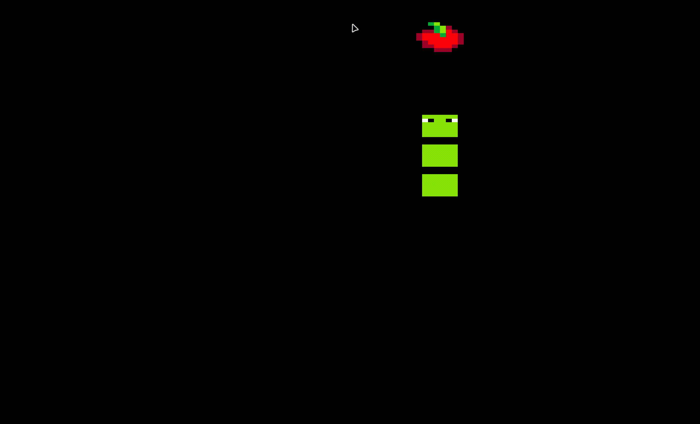

<div align=center> 
   
   # Snake Game 

    

   <p width = 50>A snake game clone to help me learn more about the SFML library and C++.</p>
   <p width = 20>This project had used heap memory allocation to store the body of each snake block, a randomize function to set a new location for the apple each time the snake ate it, and an algorithm to determine where each snake body block should be located after the snake head moves. The algorithm starts from the snake tail, where it iteratively sets the current snake body block location to the suceeding body's location until it reaches the head.</p> 
   
</div>

# Installation
> [!IMPORTANT]
> You must have already installed the SFML library on your platform. For more information, go to the official SFML website.

```
git clone git@github.com:EdwardVNguyen/snake-game.git
cd snake-game
cmake -B build -DCMAKE_EXPORT_COMPILE_COMMANDS=ON
cmake –build build
```
# Starting the Game
```
cd build/bin
./main
```
